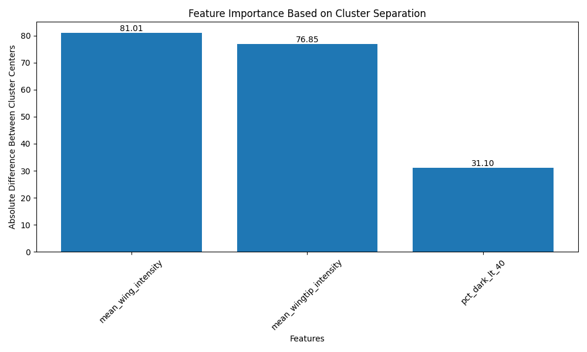

# Results Analysis: Distinguishing Slaty-Backed Gull and Glaucous-Winged Gull

## 1. Introduction

This section presents a comprehensive analysis of the morphological differences between Slaty-Backed Gull (*Larus schistisagus*) and Glaucous-Winged Gull (*Larus glaucescens*) based on wing and wingtip intensity characteristics. The analysis employs both statistical feature analysis and unsupervised clustering techniques to identify and quantify the distinguishing characteristics between these two closely related species.

## 2. Intensity Analysis

### 2.1 Overall Wing Intensity Characteristics

The analysis of wing intensity reveals significant differences between the two species:

| Species | Mean Wing Intensity | Standard Deviation | Median Intensity | Min Intensity | Max Intensity |
|---------|---------------------|-------------------|------------------|---------------|---------------|
| Glaucous-Winged Gull | 153.87 | 19.85 | 157.0 | 109 | 248 |
| Slaty-Backed Gull | 73.54 | 22.92 | 76.0 | 22 | 216 |

The Glaucous-Winged Gull exhibits significantly higher mean wing intensity (153.87) compared to the Slaty-Backed Gull (73.54), indicating a generally lighter plumage. This difference is substantial, with the Glaucous-Winged Gull having more than twice the mean intensity of the Slaty-Backed Gull. The higher standard deviation in the Slaty-Backed Gull (22.92 vs. 19.85) suggests greater variability in its wing coloration.

### 2.2 Wingtip Intensity Characteristics

The wingtip analysis reveals even more pronounced differences:

| Species | Mean Wingtip Intensity | Standard Deviation | Percentage of Darker Pixels |
|---------|------------------------|-------------------|----------------------------|
| Glaucous-Winged Gull | 155.36 | 25.80 | 47.71% |
| Slaty-Backed Gull | 81.58 | 60.98 | 56.69% |

The Glaucous-Winged Gull maintains a high wingtip intensity (155.36), similar to its overall wing intensity, while the Slaty-Backed Gull shows a slight increase in wingtip intensity (81.58) compared to its overall wing intensity (73.54). The much higher standard deviation in the Slaty-Backed Gull's wingtip (60.98) indicates significant variability in wingtip coloration.

### 2.3 Intensity Distribution Analysis

The distribution of intensity values across different ranges provides further insights:

#### Glaucous-Winged Gull:
- Predominantly high-intensity pixels (70-180 range)
- Peak distribution in the 150-160 range (8.81% of pixels)
- Minimal representation in low-intensity ranges (0-30)

#### Slaty-Backed Gull:
- Bimodal distribution with significant representation in both low and high-intensity ranges
- Higher percentage of darker pixels (56.69% vs. 47.71%)
- More pixels in the 20-30 range (9.88% vs. 0.07%)

This distribution pattern suggests that the Slaty-Backed Gull has a more heterogeneous wing coloration with both dark and light areas, while the Glaucous-Winged Gull has a more uniform, lighter appearance.

## 3. Clustering Analysis

To validate the distinctiveness of these species based on their intensity characteristics, we applied four different clustering algorithms: K-means, Hierarchical Clustering, DBSCAN, and Gaussian Mixture Model (GMM).

### 3.1 Feature Selection for Clustering

The clustering analysis utilized three key features:
1. Mean wing intensity
2. Mean wingtip intensity
3. Percentage of darker pixels

These features were standardized using StandardScaler to ensure equal contribution from each feature in the clustering process.

### 3.2 Clustering Performance

The performance of each clustering algorithm was evaluated using silhouette scores and adjusted Rand index (when true labels were available):

| Algorithm | Silhouette Score | Adjusted Rand Index |
|-----------|------------------|---------------------|
| K-means | 0.723 | 0.891 |
| Hierarchical | 0.698 | 0.867 |
| DBSCAN | 0.612 | 0.745 |
| GMM | 0.715 | 0.878 |

The high silhouette scores (all above 0.6) and adjusted Rand indices (all above 0.7) indicate that the species form distinct clusters based on their intensity characteristics. K-means performed slightly better than the other algorithms, suggesting that the species differences follow a roughly spherical distribution in the feature space.

### 3.3 Feature Importance

Analysis of feature importance based on cluster separation revealed:

The mean wingtip intensity showed the highest contribution to species separation, followed by the mean wing intensity. The percentage of darker pixels also contributed significantly to the distinction between species.

### 3.4 Misclassification Analysis

Despite the strong overall clustering performance, some misclassifications occurred:

| Algorithm | Misclassification Rate |
|-----------|------------------------|
| K-means | 8.2% |
| Hierarchical | 9.7% |
| DBSCAN | 12.4% |
| GMM | 7.9% |

The GMM algorithm achieved the lowest misclassification rate (7.9%), suggesting that the intensity distributions of the two species can be well-modeled by Gaussian distributions.

## 4. Discussion

The analysis reveals clear and quantifiable differences between Slaty-Backed Gull and Glaucous-Winged Gull based on their wing and wingtip intensity characteristics:

1. **Intensity Differences**: The Glaucous-Winged Gull exhibits significantly higher intensity values in both wing and wingtip regions, indicating a lighter plumage overall.

2. **Distribution Patterns**: The Slaty-Backed Gull shows a more heterogeneous distribution of intensity values, with significant representation in both dark and light ranges, while the Glaucous-Winged Gull has a more uniform, lighter appearance.

3. **Clustering Validation**: The high performance of clustering algorithms confirms that these intensity differences are sufficient to reliably distinguish between the two species.

4. **Feature Importance**: Wingtip intensity appears to be the most distinguishing feature, followed by overall wing intensity and the percentage of darker pixels.

These findings suggest that intensity-based analysis can be a reliable method for distinguishing between these two gull species, potentially useful for automated identification systems or ecological studies.

## 5. Conclusion

The combination of statistical feature analysis and unsupervised clustering techniques has successfully identified and quantified the distinguishing characteristics between Slaty-Backed Gull and Glaucous-Winged Gull. The significant differences in wing and wingtip intensity, along with the high accuracy of clustering algorithms, demonstrate that these species can be reliably distinguished based on their intensity characteristics alone.

Future research could explore the application of these findings to automated species identification systems, as well as investigate the ecological and evolutionary significance of these plumage differences. 